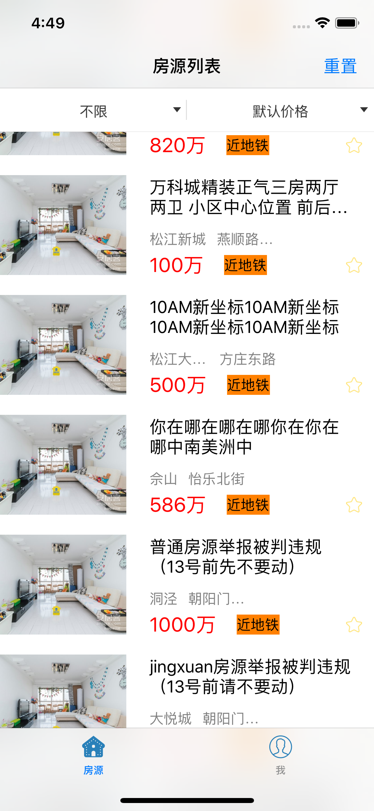
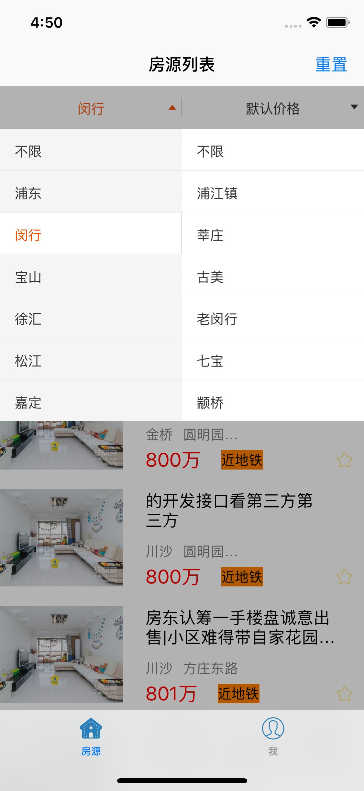
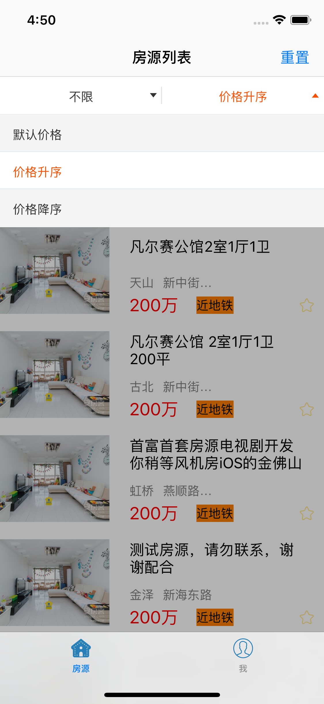

<center>
# 实习报告    
1552209 李佳乐
</center>
## 1. 任务描述      
我在58集团安居客实习，主要从事iOS开发，由于实习时间长，完成任务较多，包括但不限于以下几个方面：

- 学习xcode使用，熟悉iOS开发 
- 学习cocoapods集成三方库的方法  
- 学习git版本控制系统的使用，熟悉团队合作的机制  
- 熟悉公司代码，进行实际的小规模个人开发  
- 参与公司项目开发，实现产品需求

## 2. 技术性工作
### 2.1 cocoapods集成第三方库   

- 因为cocoapods由ruby编写，因此少不了ruby环境，首先打开终端查看当前ruby版本，版本大于等于2.2.2即可，否则[点击这里](https://www.jianshu.com/p/f43b5964f582)查看详细信息
 
  ```
  ruby -v
  
  //我的版本如下
  ruby 2.3.7p456 (2018-03-28 revision 63024) [universal.x86_64-darwin17]
  ```
- 因为ruby源国内被墙，因此将ruby源更换为ruby-china（淘宝源也已停止维护）

  ```
  gem sources --remove https://rubygems.org/
  gem sources --add https://gems.ruby-china.org/
  ```
  
- 验证ruby源是且仅是ruby-china,执行如下命令查看
  
  ```
  gem sources -l
  //得到如下结果即为正确
  
  *** CURRENT SOURCES ***

  https://gems.ruby-china.org/
  ```
- 开始安装cocoapods
 
  ```
  sudo gem install -n /usr/local/bin cocoapods
  ```
- 安装本地库

  ```
  pod setup
  ```
- 执行结果,等待过程较为漫长

  ```
  Setting up CocoaPods master repo
  $ /usr/bin/git clone https://github.com/CocoaPods/Specs.git master --progress
  Cloning into 'master'...
  remote: Counting objects: 1879515, done.        
  remote: Compressing objects: 100% (321/321), done.        
  Receiving objects:  21% (404525/1879515), 73.70 MiB | 22.00 KiB/
  ```
  
- 完成后可搜索一个三方库检验是否成功
 
  ```
  pod search masonry
  ```
  
- cocoapods具体在工程中的使用

  在xcode工程目录下，创建Podfile文件：
  
  ```
  pod init
  ```
  在文件目录生成一个Podfile文件，例如要添加masonry,Realm库,在文件中编写如下代码
  
  ``` ruby
  #platform :ios, '9.0'
  
  target 'projectname' do
        pod 'Masonry', '~> 1.1.0'
        pod 'Realm',    '3.3.0'
  end
  ```
  
  > 更新cocoapods版本：
  `gem install cocapods`
  
  > 更新本地库：
  `pod repo update`
  
### 2.2 版本控制系统git的使用
- git简介
  
  git是目前世界上那个最先进的版本控制系统，git是分布式的版本控制系统，文件不需要保存再中央服务器，这就意味着你完全可以在本地使用git带来的便利。git可以记录文件的每次改动，并可以让你随时会退到任何版本。不仅仅是这样，git的更大便利体现在多人协作上，大家可以统一git仓库上进行开发，大家在本地进行开发，然后将更新提交到远程仓库中，远程仓库默认只有一个master分支，而master分支的文件相对比较重要，如果提交导致了master的损坏，后果将不堪设想，因此我们在工作中常常使用如下方法使用git：
  
  1. 将共有仓库(以learngit为例)fork到个人的仓库中-在GitHub的网站上点击fork即可
  2. 将本地的ssh key添加到个人远程仓库中
  3. 将个人远程仓库克隆到本地`git clone https://github.com/Vin98/learngit`
  4. 将远程仓库与本地仓库关联`git remote add upstream https://github.com/Vin98/learngit`
  5. 使用`git remote -v`可查看当前关联的远程库
  6. 拉取远程仓库中有的本地没有的文件`git fetch upstream`
  7. 假设共有仓库上有一个分支dev_1.0，切换到这个分支`git checkout upstream/dev_1.0`
  8. 创建自己的分支`git checkout -b lijiale_dev_1.0`
  9. 更新pod库`pod update`
  10. 提交文件修改时`git add .`将所有更新保存到暂存区，`git commit -m "更新的内容"`将暂存区中的文件提交到本地仓库
  11. 拉取远程有的而本地没有的文件，此步骤主要是保证本地为最新文件，因为别人也有可能进行的提交`git fetch upstream`，将拉取到的新文件与本地文件合并`git rebase upstream/dev_1.0`,若成功则提交文件`git push origin lijiale_dev_1.0`，若不成功则多为你的更新与别人的更新发生了冲突，Xcode中会用`c`标识出冲突的文件，解决冲突之后再`git add .`然后`git rebase --continue`，再进行提交即可
  
  > git中常用的一些操作:   
  
  > 初始化仓库`git init`    
  > 查看当前仓库状态`git status`   
  > 查看具体修改内容 `git diff filename`   
  > 回退到上一个版本：`git reset --hard HEAD^`
    或者使用具体的commit-id `git reset --hard commit_id`    
  > 查看工作区和版本库最新版本的区别`git diff HEAD -- filename`   
  > 丢弃工作区的修改：`git checkout -- filename` 即将filename文件在工作区的修	 改全部撤销，当没有被放到暂存区时回退到版本库中的版本,当放到暂存区后会回退到暂存	 区中的版本    
  > 撤销暂存区的修改，将暂存区的修改回退到工作区  `git reset HEAD filename`   
  > 当在工作区删除文件时（假设文件已在版本库中）   
	 第一种情况：将文件从版本库中也删除`git rm/add filename`
              `git commit -m "log"`   
 	 第二种情况：恢复误删的文件也就是撤销工作区的修改`git checkout -- filename`
 	 
 	 
### 2.3 个人小规模开发     
- 项目功能：实现一个房源信息列表，并可以根据价格，区域板块进行筛选，收藏功能,分享功能  

- 项目设计,用AppDelegate代理监听系统事件并设置根视图，列表及收藏页面采用`UITableview`，并重写`UITableviewCell`，写房源model `HLCHouseItem`,并使用一个单例`HLCHouseItemStore`保存房源信息，具体实现如下,由于代码较长，只贴.h文件部分

1. AppDelegate:设置APP代理，监听系统事件   
  
  ```objc
  - (BOOL)application:(UIApplication *)application didFinishLaunchingWithOptions:(NSDictionary *)launchOptions {
    // Override point for customization after application launch.
    	self.window = [[UIWindow alloc] initWithFrame:[UIScreen mainScreen].bounds];
    	HLCListViewController *listViewController = [[HLCListViewController alloc] init];
    	HLCMyCollectionViewController *mycollection = [[HLCMyCollectionViewController alloc] init];
    	UINavigationController *listNavController = [[UINavigationController alloc] initWithRootViewController:listViewController];
    	UINavigationController *collectionNavController = [[UINavigationController alloc] initWithRootViewController:mycollection];
    	UITabBarController *tabBarController = [[UITabBarController alloc] init];
    	tabBarController.viewControllers = @[listNavController,collectionNavController];
    	self.window.rootViewController = tabBarController;
    	self.window.backgroundColor = [UIColor whiteColor];
    	[self.window makeKeyAndVisible];
    	return YES;
}
  ```
  
2. 房源信息model`HLCHouseItem` 类  
  
  ```objc
  //
//  HLCHouseItem.h
//  
//
//  Created by lijiale on 2018/7/30.
//


	#import <Foundation/Foundation.h>
@interface HLCHouseItem : NSObject
@property (nonatomic) NSUInteger houseID;
@property (nonatomic, copy)NSString *houseName;
@property (nonatomic, copy)NSString *houseArea;
@property (nonatomic, copy)NSString *houseBlock;
@property (nonatomic, copy)NSString *houseImage;
@property (nonatomic, copy)NSString *housePrice;
@property (nonatomic, copy)NSString *houseAddress;
@property (nonatomic)BOOL isCollected;

	- (instancetype)initWithHouseID:(NSUInteger)ID houseName:(NSString *)name houseArea:(NSString *)area houseBlock:(NSString*)block housePrice:(NSString *)price houseAddress:(NSString *)address houseImage:(NSString *)image;
@end

  ```
  
3. 房源管理单例`HLCHouseItemStore`类   

	```objc
//
//  HLCHouseItemStore.h
//  HouseList&Collection
//
//  Created by lijiale on 2018/7/30.
//  Copyright © 2018年 lijiale. All rights reserved.
//

	#import <Foundation/Foundation.h>
typedef NS_ENUM(NSInteger, priceSort){
    	priceSortByDefault = 0,
    	priceSortByAsc = 1,
    	priceSortByDesc = 2
};
@class HLCHouseItem;
@interface HLCHouseItemStore : NSObject
@property (nonatomic, strong) NSArray *HouseList;
@property (nonatomic, strong) NSArray *collectionList;
@property (nonatomic, copy) NSString *currentSelectedArea;
@property (nonatomic, copy) NSString *currebtSelectedBlock;
@property (nonatomic) priceSort currentPriceSort;
@property (nonatomic)NSUInteger houseCount;
+ (instancetype)sharedStore;
- (HLCHouseItem *)addWithHouseID:(NSUInteger)ID houseName:(NSString *)name houseArea:(NSString *)area houseBlock:(NSString *)block housePrice:(NSString *)price houseAddress:(NSString *)address houseImage:(NSString *)image isCollected:(BOOL)iscolleted;
- (void)setCurrentSelectedArea:(NSString *)area Block:(NSString *)block;
- (void)setPriceSort:(priceSort)price;
- (void)clearFliter;
- (void)fliterHouseList;
- (void)sortHouseList;
- (BOOL)updateList;
- (void)changeCollectStateWithHouseID:(NSInteger)ID;
@end

	```
4. 房源列表页Controller
	
	```objc
	//
//  HLCListViewController.m
//  HouseList&Collection
//
//  Created by lijiale on 2018/7/26.
//  Copyright © 2018年 lijiale. All rights reserved.
//
	#define MAS_SHORTHAND_GLOBALS
#import "HLCListViewController.h"
#import "HLCHouseTableViewCell.h"
#import "DOPDropDownMenu.h"
#import "HLCHouseItem.h"
#import "HLCHouseItemStore.h"
#import <SDWebImage/UIImageView+WebCache.h>

	@interface HLCListViewController ()<DOPDropDownMenuDataSource, DOPDropDownMenuDelegate>
@property (nonatomic, strong) NSArray *areas;
@property (nonatomic, strong) NSArray *blocks;
@property (nonatomic, strong) NSArray *sorts;
@property (nonatomic, strong) DOPDropDownMenu *menu;
@end

	@implementation HLCListViewController

	- (instancetype)init{
    self = [super init];
    self.tableView.separatorStyle = UITableViewCellSeparatorStyleNone;
    if(self){
        self.tabBarItem.title = @"房源";
        UIImage *house = [[UIImage imageNamed:@"house"] imageWithRenderingMode:UIImageRenderingModeAlwaysOriginal];
        self.tabBarItem.image = house;
        UIImage *house_selected = [[UIImage imageNamed:@"house_selected"] imageWithRenderingMode:UIImageRenderingModeAlwaysOriginal];
        self.tabBarItem.selectedImage = house_selected;
    }
    return self;
}
	#pragma mark - view life cycle
	- (void)viewDidLoad {
    [super viewDidLoad];
    //[NSThread sleepForTimeInterval:(1.0)];
    self.navigationItem.title = @"房源列表";
    //设置UIView从导航栏下面开始
    self.navigationController.navigationBar.translucent = NO;
    self.navigationItem.rightBarButtonItem = [[UIBarButtonItem alloc]initWithTitle:@"重置" style:UIBarButtonItemStylePlain target:self action:@selector(menuReloadData)];
    DOPDropDownMenu *menu = [[DOPDropDownMenu alloc] initWithOrigin:CGPointMake(0, 0) andHeight:44];
    menu.delegate = self;
    menu.dataSource = self;
    _menu = menu;
    [self.tableView registerClass:[HLCHouseTableViewCell  class] forCellReuseIdentifier:@"HouseCell"];
    
	}
	- (void)viewWillAppear:(BOOL)animated{
    [super viewWillAppear:YES];
    [self.tableView reloadData];
}
	#pragma mark - action
- (void)menuReloadData
{
    [_menu reloadData];
    [[HLCHouseItemStore sharedStore] clearFliter];
    [[HLCHouseItemStore sharedStore] fliterHouseList];
    [[HLCHouseItemStore sharedStore] sortHouseList];
    [self.tableView reloadData];
}
	#pragma mark - dropDownMenu
- (NSInteger)numberOfColumnsInMenu:(DOPDropDownMenu *)menu{
    return 2;
}
- (NSInteger)menu:(DOPDropDownMenu *)menu numberOfRowsInColumn:(NSInteger)column{
    if(column == 0){
        return self.blocks.count;
    }
    else{
        return self.sorts.count;
    }
}
-(NSString *)menu:(DOPDropDownMenu *)menu titleForRowAtIndexPath:(DOPIndexPath *)indexPath{
    if(indexPath.column == 0){
        return self.areas[indexPath.row];
    }
    else{
        return self.sorts[indexPath.row];
    }
}
- (NSInteger)menu:(DOPDropDownMenu *)menu numberOfItemsInRow:(NSInteger)row column:(NSInteger)column{
    if(column == 0){
        if(row == 0){
            return 0;
        }
        NSArray *items = self.blocks[row];
        return items.count;
    }
    else{
        return 0;
    }
}
- (NSString *)menu:(DOPDropDownMenu *)menu titleForItemsInRowAtIndexPath:(DOPIndexPath *)indexPath{
    if(indexPath.column == 0){
        NSArray *items = self.blocks[indexPath.row];
        return items[indexPath.item];
    }
    return 0;
}
- (void)menu:(DOPDropDownMenu *)menu didSelectRowAtIndexPath:(DOPIndexPath *)indexPath
{
    HLCHouseItemStore *store = [HLCHouseItemStore sharedStore];
    if(indexPath.column == 0){
        if (indexPath.item >= 0) {
            if([store.currentSelectedArea isEqualToString:self.areas[indexPath.row]] &&
               [store.currebtSelectedBlock isEqualToString:self.blocks[indexPath.row][indexPath.item]]){
                return;
            }
            [store setCurrentSelectedArea:self.areas[indexPath.row] Block:self.blocks[indexPath.row][indexPath.item]];
        }else {
            if(indexPath.row == 0){
                if([store.currentSelectedArea isEqualToString:@"不限"] &&
                   [store.currebtSelectedBlock isEqualToString:@"不限"]){
                    return;
                }
                [store setCurrentSelectedArea:@"不限" Block:@"不限"];
            }
        }
        [store fliterHouseList];
    }
    else if(indexPath.column == 1){
        priceSort price = indexPath.row;
        [store setPriceSort:price];
    }
    [store sortHouseList];
    [self.tableView reloadData];
}
	#pragma mark - cell
- (UIView *)tableView:(UITableView *)tableView viewForHeaderInSection:(NSInteger)section{
    return self.menu;
}
- (CGFloat)tableView:(UITableView *)tableView heightForHeaderInSection:(NSInteger)section{
    return 44;
}
- (void)didReceiveMemoryWarning {
    [super didReceiveMemoryWarning];
    // Dispose of any resources that can be recreated.
}
- (NSInteger)numberOfSectionsInTableView:(UITableView *)tableView{
    return 1;
}
- (NSInteger)tableView:(UITableView *)tableView numberOfRowsInSection:(NSInteger)section{
    NSLog(@"count of houselist is %lu",[[[HLCHouseItemStore sharedStore] HouseList] count]);
    return [[[HLCHouseItemStore sharedStore] HouseList] count];
}
- (CGFloat)tableView:(UITableView *)tableView heightForRowAtIndexPath:(NSIndexPath *)indexPath{
    return 120;
}
- (UITableViewCell *)tableView:(UITableView *)tableView cellForRowAtIndexPath:(NSIndexPath *)indexPath{
    HLCHouseTableViewCell *cell = [tableView dequeueReusableCellWithIdentifier:@"HouseCell" forIndexPath:indexPath];
    if(!cell){
        cell = [[HLCHouseTableViewCell alloc] initWithStyle:UITableViewCellStyleSubtitle reuseIdentifier:@"HouseCell"];
    }
    NSArray *houseList = [HLCHouseItemStore sharedStore].HouseList;
    HLCHouseItem *house = houseList[indexPath.row];
    cell.houseName.text = house.houseName;
    cell.housePrice.text = [house.housePrice stringByAppendingString:@"万"];
    cell.houseBlock.text = house.houseBlock;
    cell.houseCommunity.text = house.houseAddress;  
    //cell.houseLoaction.text = [house.houseArea stringByAppendingString:house.houseBlock];
    cell.houseCollection.tag = house.houseID;
    NSURL *imageUrl = [NSURL URLWithString:house.houseImage];
    //imageUrl = [NSURL URLWithString:@"https://pic1.ajkimg.com/display/anjuke/600675-%E6%88%91%E7%88%B1%E6%88%91%E5%AE%B6/ead933be14ffc87240b9fc4d1c664763-599x450.jpg?t=1"];
    [cell.houseImage sd_setImageWithURL:imageUrl completed:^(UIImage * _Nullable image, NSError * _Nullable error, SDImageCacheType cacheType, NSURL * _Nullable imageURL) {
        NSLog(@"load image complete");
    }];
    [cell.houseCollection addTarget:self action:@selector(collectHouse:) forControlEvents:UIControlEventTouchUpInside];
    if(house.isCollected){
        [cell.houseCollection setImage:[UIImage imageNamed:@"star_collected"] forState:UIControlStateNormal];
    }
    else{
        [cell.houseCollection setImage:[UIImage imageNamed:@"star_notcollect"] forState:UIControlStateNormal];
    }
//    if(indexPath.row == houseList.count - 2){
//        if([[HLCHouseItemStore sharedStore] updateList] == YES){
//            [self.tableView reloadData];
//        }
//    }
    return cell;
}
- (void)collectHouse:(UIButton *)sender{
    UIAlertController *alertController = [UIAlertController alertControllerWithTitle:@"👌" message:@"收藏成功" preferredStyle:UIAlertControllerStyleAlert];
    UIAlertAction *okAction = [UIAlertAction actionWithTitle:@"确定" style:UIAlertActionStyleCancel handler:nil];
    NSArray *houselist = [[HLCHouseItemStore sharedStore] HouseList];
    for (HLCHouseItem *house in houselist) {
        if(house.houseID == sender.tag){
            if(house.isCollected == YES){
                [sender setImage:[UIImage imageNamed:@"star_notcollect"] forState:UIControlStateNormal];
                [alertController setMessage:@"取消收藏成功"];
            }
            else{
                [sender setImage:[UIImage imageNamed:@"star_collected"] forState:UIControlStateNormal];
                [alertController setMessage:@"收藏成功"];
            }
            break;
        }
    }
    [alertController addAction:okAction];
    [self presentViewController:alertController animated:YES completion:nil];
    [[HLCHouseItemStore sharedStore] changeCollectStateWithHouseID:sender.tag];
}
- (NSArray *)sorts{
    _sorts = @[@"默认价格",@"价格升序",@"价格降序"];
    return _sorts;
}
	```
5. 收藏页Controller

	```objc
	//
//  HLCMyCollectionViewController.m
//  HouseList&Collection
//
//  Created by lijiale on 2018/7/28.
//  Copyright © 2018年 lijiale. All rights reserved.
//

	#import "HLCMyCollectionViewController.h"
#import "HLCHouseTableViewCell.h"
#import "HLCHouseItemStore.h"
#import "HLCHouseItem.h"
#import <SDWebImage/UIImageView+WebCache.h>

	@implementation HLCMyCollectionViewController

	/*
// Only override drawRect: if you perform custom drawing.
// An empty implementation adversely affects performance during animation.
- (void)drawRect:(CGRect)rect {
    // Drawing code
}
*/
- (instancetype)init{
    self = [super init];
    if(self){
        self.tableView.separatorStyle = UITableViewCellSeparatorStyleNone;
        self.tabBarItem.title = @"我";
        UIImage *user = [[UIImage imageNamed:@"user"] imageWithRenderingMode:UIImageRenderingModeAlwaysOriginal];
        self.tabBarItem.image = user;
        UIImage *user_selected = [[UIImage imageNamed:@"user_selected"] imageWithRenderingMode:UIImageRenderingModeAlwaysOriginal];
        self.tabBarItem.selectedImage = user_selected;
    }
    return self;
}
- (void)viewDidLoad{
    [super viewDidLoad];
    self.navigationItem.title = @"我的收藏";
    NSLog(@"View did Load");
    //设置UIView从导航栏下面开始
    self.navigationController.navigationBar.translucent = NO;
    self.navigationItem.rightBarButtonItem = [[UIBarButtonItem alloc]initWithTitle:@"分享" style:UIBarButtonItemStylePlain target:self action:@selector(collectionShare:)];
    [self.tableView registerClass:[HLCHouseTableViewCell  class] forCellReuseIdentifier:@"CollectionCell"];
}
- (void)viewWillAppear:(BOOL)animated{
    [super viewWillAppear:YES];
    [self.tableView reloadData];
}
#pragma mark - cell
- (NSInteger)numberOfSectionsInTableView:(UITableView *)tableView{
    return 1;
}
- (NSInteger)tableView:(UITableView *)tableView numberOfRowsInSection:(NSInteger)section{
    return [[HLCHouseItemStore sharedStore] collectionList].count;
}
- (CGFloat)tableView:(UITableView *)tableView heightForRowAtIndexPath:(NSIndexPath *)indexPath{
    return 120;
}
- (UITableViewCell *)tableView:(UITableView *)tableView cellForRowAtIndexPath:(NSIndexPath *)indexPath{
    HLCHouseTableViewCell *cell = [tableView dequeueReusableCellWithIdentifier:@"CollectionCell" forIndexPath:indexPath];
    if(!cell){
        cell = [[HLCHouseTableViewCell alloc] initWithStyle:UITableViewCellStyleSubtitle reuseIdentifier:@"CollectionCell"];
    }
    NSArray *houseList = [HLCHouseItemStore sharedStore].collectionList;
    HLCHouseItem *house = houseList[indexPath.row];
    cell.houseName.text = house.houseName;
    cell.housePrice.text = [house.housePrice stringByAppendingString:@"万"];
    cell.houseLoaction.text = [house.houseArea stringByAppendingString:house.houseBlock];
    cell.houseCollection.tag = house.houseID;
    NSURL *imageUrl = [NSURL URLWithString:house.houseImage];
    //imageUrl = [NSURL URLWithString:@"https://pic1.ajkimg.com/display/anjuke/600675-%E6%88%91%E7%88%B1%E6%88%91%E5%AE%B6/ead933be14ffc87240b9fc4d1c664763-599x450.jpg?t=1"];
    [cell.houseImage sd_setImageWithURL:imageUrl completed:^(UIImage * _Nullable image, NSError * _Nullable error, SDImageCacheType cacheType, NSURL * _Nullable imageURL) {
        NSLog(@"load image complete");
    }];
    [cell.houseCollection addTarget:self action:@selector(collectHouse:) forControlEvents:UIControlEventTouchUpInside];
    if(house.isCollected){
        [cell.houseCollection setImage:[UIImage imageNamed:@"star_collected"] forState:UIControlStateNormal];
    }
    else{
        [cell.houseCollection setImage:[UIImage imageNamed:@"star_notcollect"] forState:UIControlStateNormal];
    }
    return cell;
}
- (void)collectHouse:(UIButton *)sender{
    UIAlertController *alertController = [UIAlertController alertControllerWithTitle:@"👌" message:@"收藏成功" preferredStyle:UIAlertControllerStyleAlert];
    UIAlertAction *okAction = [UIAlertAction actionWithTitle:@"确定" style:UIAlertActionStyleCancel handler:nil];
    NSArray *houselist = [[HLCHouseItemStore sharedStore] HouseList];
    for (HLCHouseItem *house in houselist) {
        if(house.houseID == sender.tag){
            if(house.isCollected == YES){
                [sender setImage:[UIImage imageNamed:@"star_notcollect"] forState:UIControlStateNormal];
                [alertController setMessage:@"取消收藏成功"];
            }
            else{
                [sender setImage:[UIImage imageNamed:@"star_collected"] forState:UIControlStateNormal];
                [alertController setMessage:@"收藏成功"];
            }
            break;
        }
    }
    [alertController addAction:okAction];
    [self presentViewController:alertController animated:YES completion:nil];
    [[HLCHouseItemStore sharedStore] changeCollectStateWithHouseID:sender.tag];
    [self.tableView reloadData];
}
//截图
- (UIImage *)getCurrentScreenShot{
    UIGraphicsBeginImageContextWithOptions([[[UIApplication sharedApplication] keyWindow] bounds].size, NO, 0.0);
    [[[UIApplication sharedApplication] keyWindow].layer renderInContext:UIGraphicsGetCurrentContext()];
    UIImage *image = UIGraphicsGetImageFromCurrentImageContext();
    UIGraphicsEndImageContext();
    
    return image;
}
- (void)collectionShare:(UIButton *)sender{
    UIImage *shareImage = [[UIImage alloc] init];
    shareImage = [self getCurrentScreenShot];
    UIActivityViewController *share = [[UIActivityViewController alloc] initWithActivityItems:@[shareImage] applicationActivities:nil];
    [self presentViewController:share animated:YES completion:nil];
    [share setCompletionWithItemsHandler:^(UIActivityType  _Nullable activityType, BOOL completed, NSArray * _Nullable returnedItems, NSError * _Nullable activityError) {
        NSLog(@"当前分享平台 %@",activityType);
        if(completed){
            NSLog(@"分享成功");
        }
        else{
            NSLog(@"分享失败");
        }
    }];
}
@end

	```
6. 自定义TableViewCell类    

	```objc
	//
//  HLCHouseTableViewCell.m
//  HouseList&Collection
//
//  Created by lijiale on 2018/7/26.
//  Copyright © 2018年 lijiale. All rights reserved.
//

	#import "HLCHouseTableViewCell.h"

	@implementation HLCHouseTableViewCell

	- (void)awakeFromNib {
    [super awakeFromNib];
    // Initialization code
}
	- (void)setSelected:(BOOL)selected animated:(BOOL)animated {
    [super setSelected:selected animated:animated];

    // Configure the view for the selected state
}
	- (void)setFrame:(CGRect)frame{
    frame.size.height = 120;
    frame.size.width = [UIScreen mainScreen].bounds.size.width;
    [super setFrame:frame];
}
- (instancetype)initWithStyle:(UITableViewCellStyle)style reuseIdentifier:(NSString *)reuseIdentifier{
    self = [super initWithStyle:style reuseIdentifier:reuseIdentifier];
    if(self){
        self.backgroundColor = [UIColor clearColor];
        //self.layer.cornerRadius = 10;
        self.layer.masksToBounds = YES;
        //self.layer.shouldRasterize = YES;
        self.layer.borderColor = [UIColor grayColor].CGColor;
        self.layer.borderWidth = 0.1;
        //创建houseImage
        self.houseImage = [[UIImageView alloc] init];
        [self.houseImage setContentMode:UIViewContentModeScaleAspectFill];
        //self.houseImage.translatesAutoresizingMaskIntoConstraints = NO;
        self.houseImage.backgroundColor = [UIColor clearColor];
        self.houseImage.contentMode = UIViewContentModeScaleAspectFill;
        [self.contentView addSubview:self.houseImage];
        [self.houseImage mas_makeConstraints:^(MASConstraintMaker *make) {
            make.height.equalTo(@100);
            make.width.equalTo(@100);
            make.left.equalTo(self.mas_left).with.offset(10);
            make.top.equalTo(self.mas_top).with.offset(10);
        }];
        //创建houseName
        self.houseName = [[UILabel alloc] init];
        self.houseName.backgroundColor = [UIColor clearColor];
        self.houseName.contentMode = UIViewContentModeBottom;
        self.houseName.numberOfLines = 0;
        [self.contentView addSubview:self.houseName];
        [self.houseName mas_makeConstraints:^(MASConstraintMaker *make) {
            make.left.equalTo(self.houseImage.mas_right).with.offset(40);
            make.top.equalTo(self.houseImage.mas_top);
            make.right.equalTo(self.mas_right).with.offset(-20);
            make.height.equalTo(@44);
        }];
        //创建tag
        //创建houseBlock
        self.houseBlock = [[UILabel alloc] init];
        self.houseBlock.backgroundColor = [UIColor clearColor];
        [self.houseBlock sizeToFit];
        self.houseBlock.alpha = 0.5;
        self.houseBlock.font = [UIFont systemFontOfSize:14];
        [self.contentView addSubview:self.houseBlock];
        [self.houseBlock mas_makeConstraints:^(MASConstraintMaker *make) {
            make.left.equalTo(self.houseName.mas_left);
            make.height.equalTo(@20);
            make.width.lessThanOrEqualTo(@60);
            make.top.equalTo(self.houseName.mas_bottom).with.offset(10);
        }];
        //创建houseCommunity
        self.houseCommunity = [[UILabel alloc] init];
        self.houseCommunity.backgroundColor = [UIColor clearColor];
        [self.houseCommunity sizeToFit];
        self.houseCommunity.alpha = 0.5;
        self.houseCommunity.font = [UIFont systemFontOfSize:14];
        [self.contentView addSubview:self.houseCommunity];
        [self.houseCommunity mas_makeConstraints:^(MASConstraintMaker *make) {
            make.left.equalTo(self.houseBlock.mas_right).with.offset(10);
            make.height.equalTo(@20);
            make.width.lessThanOrEqualTo(@120);
            make.top.equalTo(self.houseBlock.mas_top);
        }];
        //创建housePrice
        self.housePrice = [[UILabel alloc] init];
        self.housePrice.backgroundColor = [UIColor clearColor];
        [self.housePrice sizeToFit];
        self.housePrice.font = [UIFont systemFontOfSize:20];
        self.housePrice.textColor = [UIColor redColor];
        [self.contentView addSubview:self.housePrice];
        [self.housePrice mas_makeConstraints:^(MASConstraintMaker *make) {
            make.left.equalTo(self.houseName.mas_left);
            make.height.equalTo(@20);
            make.bottom.equalTo(self.houseImage);
        }];
        //h创建tag
        self.tag1 = [[UILabel alloc] init];
        self.tag1.backgroundColor = [UIColor orangeColor];
        [self.tag1 sizeToFit];
        self.tag1.font = [UIFont systemFontOfSize:14];
        self.tag1.text = @"近地铁";
        [self.contentView addSubview:self.tag1];
        [self.tag1 mas_makeConstraints:^(MASConstraintMaker *make) {
            make.left.equalTo(self.housePrice.mas_right).with.offset(20);
            make.height.equalTo(@20);
            make.bottom.equalTo(self.houseImage);
        }];
        //创建收藏按钮
        self.houseCollection = [[UIButton alloc] init];
        self.houseCollection.backgroundColor = [UIColor clearColor];
        [self.houseCollection setImage:[UIImage imageNamed:@"star_notcollect"] forState:UIControlStateNormal];
        [self.contentView addSubview:_houseCollection];
        [self.houseCollection mas_makeConstraints:^(MASConstraintMaker *make) {
            make.right.equalTo(self.mas_right).offset(-10);
            make.height.equalTo(self.housePrice);
            make.width.equalTo(self.houseCollection.mas_height);
            make.top.equalTo(self.housePrice);
        }];
    }
    return self;
}
@end

	```   
	
- 项目结果截图

<center class="half">
    
    
    
</center>
<center class="half">
    
    
    
</center>

### 2.4 公司项目开发，完成产品需求    
 > **由于公司代码不可外传，因此此部分只宏观解释完成内容及方法**   
 
 - 在各处列表页新加来源tag,后端同学新加字段，我负责读取该字段并根据其内容展示不同tag
 - 拍摄视频时强制开启定位  
   
   > 方法:点击拍摄时检测当前系统定位以及APP定位是否打开，未打开则弹窗提示用户去打开并停止拍摄，监测定位状态是否发生变化以决定是否允许用户进行拍摄   
   同时将得到的位置信息上传后端，使用公司封装的基于AFNetworking的网络库进行上传
 - 上传图片允许用户使用iCloud图片
   
   > 默认情况下图片选择时不可选择iCloud图片，此时需在PHAsset获取时开启iCloud权限，允许用户选择
   
## 3. 非技术性工作    
- 了解与计算机科学与技术有关的技术标准和法律、法规情况，在工程规范及质量意识方面有哪些提升？    

> - 每一种编程语言可能有几套不同的代码规范，而每一个公司又有自己的一套固定的代码规范，为了使团队合作更加契合，大家都应遵守既定的规范，这在很大程度上使得团队合作更加便捷，而且统一的代码规范也使项目维护起来更加方便。

> - 对于公司来说，项目代码属于商业机密，任何人不可以在外网传播，受到相关法律的约束

> - 对于iOS系统来说，权限检查特别严谨，开发者不可以使用未经授权的方法，即使利用一些漏洞使用相关方法，在APPStore上架审核时也不会通过，因此在开发中应该遵守想关规范。

- 你所参与的计算机系统方案对环境和社会可持续发展有哪些影响？    

> 我所参与的是二手房源的租售APP的开发，可提升社会上的二手房屋的利用率，对社会可持续发展具有重要意义。

- 在你所参与的计算机系统方案中，是怎么考虑降低系统对社会和环境的负面影响的？有无局限性？   

> 项目的开发过程是完善的，从产品提出需求到产品与开发沟通开会，以及开发完成后的与其他部门的联合调试，以及开发者的自测，最后提交给专业测试人员进行全量测试，在各个环节保证APP的平稳运行，多方面降低了系统对社会和环境的负面影响，即使出现了线上bug，开发者也会在第一时间进行修复，也大大降低了负面影响。

- 在实习中你是如何与团队成员（含你的领导）交流，如何使自己在项目中发挥重要（骨干甚至领导）作用的？发挥了哪些作用？   

> 首先，所有团队成员各司其职，在项目需求讨论时便规定好各自的任务，工作中大家的责任心都很高，都会全力完成自己的需求。每个成员都会提供一个供外部使用的接口，各自封装好自己的代码块，这样可以保证大家团队开发但又保持独立，很大程度上解决了成员间的冲突。当某一成员有问题需要沟通时，便会找负责这个部分的同学沟通，极大的提高了开发效率。  
>
  当我遇到一些问题时，我会首先上网搜索解决方案，当长时间还未找到解决方法时再去找能力更高的同事去讨论，在讨论中也会提出一些其他的问题，比如当前代码中存在的一些问题。如果不是技术上的问题而要去找自己的领导进行沟通时，首先要找领导不是很忙的时间去，然后大方提出自己的问题以求解决。
> 
  由于刚进入公司不久，只是担任了一些日常业务的开发，虽说不是骨干地位，但是也配合大家完成了必须的需求，为APP的稳定运行贡献了自己的一份力量。

- 在实习中，你是如何培养自己运用工程原理和经济决策方法分析计算机应用系统方案及其可行性的能力的？   

> - 首先利用工程原理分析项目的理论上的可能性    
> 	 从自己这方面的开发出发，首先列出多种解决方案并从中选出一种高效的方案，主要体现在实现简单能耗低性能高方面考虑，写出大体思路，来判断是否可行。然后和其他部门的同学沟通，讨论在其他方面是否可行。
> 
> - 再利用经济决策方法分析项目在实际应用中的可能性
>   由测试人员给出模拟数据，模拟实际情况下项目的运行情况以及收益，如果符合预期则可投入使用，如果达不到预期就应该考虑项目需求是否完善可靠，从根源解决问题。
   

- 你是如何将专业知识运用于解决多学科环境的问题的？

> 无论是哪个方面的工作或者哪一门语言，最终学习到的是分析问题解决问题的能力，不管是哪个学科，都应遵循这样分析问题的方式，与他人合作也应遵循这样的方案。从需求提出到需求的讨论，从正式移交给开发到开发完成后的测试，这样的模式在各个学科都适用，在每一个项目上都至少应该存在这样的步骤，这样才能促使团队合作，在每一个学科上都应如此。


## 实习总结
　　我的实习还没有结束，还有很长一段时间去锻炼去学习，这是一个从学校到公司的过渡，是一个从个人项目到集体项目的过渡，也是我从学生到程序员的过渡。这个过程将会完全改变既有的学习方式，将从各个方面去改变我的状态，我将变的更加独立但又更加能融入团队合作，这是对立统一的。我希望能在实习中学习到更多东西，不只是一些技术知识，也包括很多社会中的与人相处的经验，以及解决问题的思维，这才是整个实习过程中最重要的。
   
 

 
 
    
  
  
  
  
  